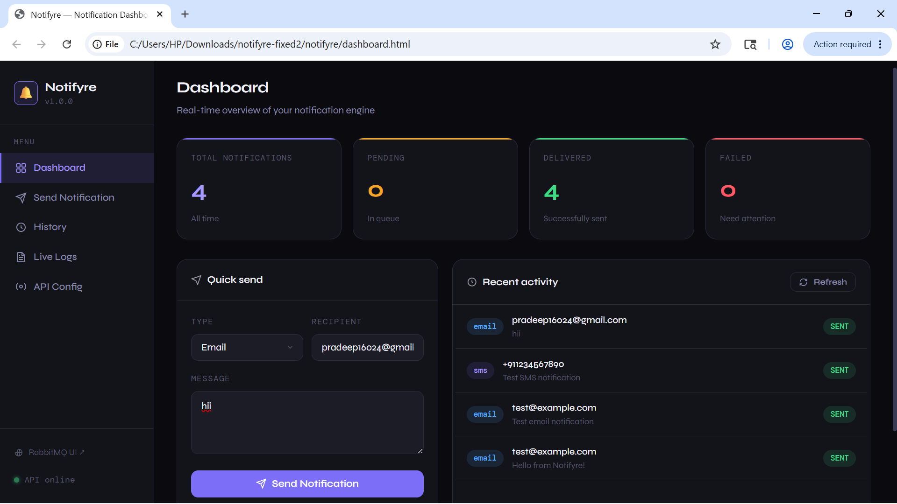
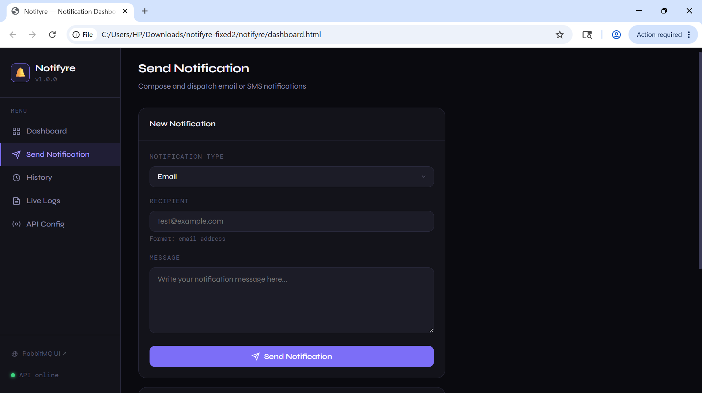
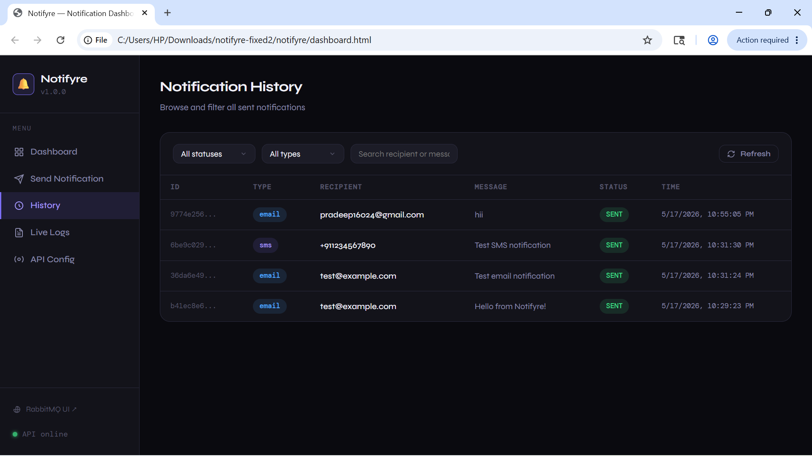
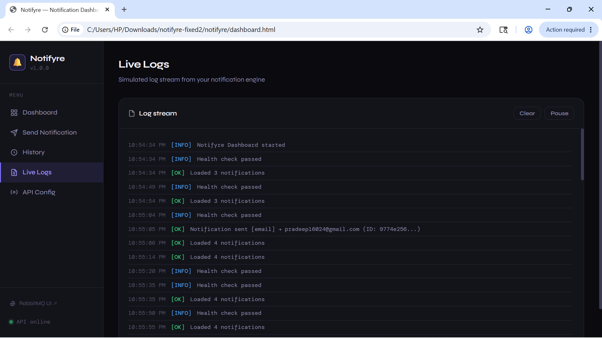
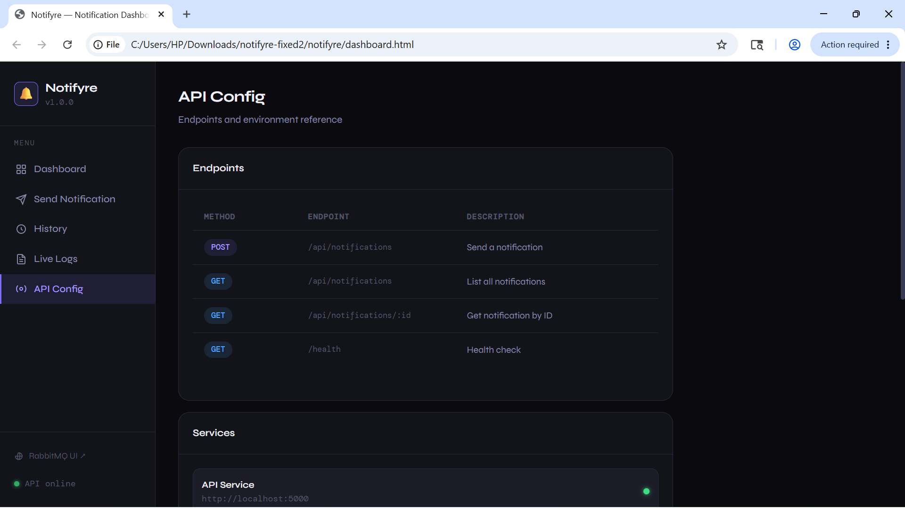

# 🔔 Notifyre — Event-Driven Notification Engine      

> A production-ready microservices notification engine. Send emails and SMS at scale with automatic retries, dead-letter queues, full delivery tracking — all running in Docker with a beautiful web dashboard.

## 📸 Screenshots






---

## ✨ Features

| Feature | Description |
|---|---|
| 📧 **Email & SMS** | Send via SendGrid (email) and Twilio (SMS) |
| 🐰 **RabbitMQ** | Async message broker with direct exchanges |
| 🔁 **Auto-retry** | Up to 3 attempts with 15s delay between retries |
| 💀 **Dead Letter Queue** | Permanently failed messages tracked and logged |
| 🗄️ **PostgreSQL** | Full event sourcing and audit trail |
| 🧪 **DRY_RUN mode** | Test the full pipeline without real API keys |
| 🐳 **Docker Compose** | One-command setup — no local installs needed |
| 📊 **Web Dashboard** | Beautiful UI to send, monitor, and filter notifications |
| 📈 **Scalable Workers** | Run multiple worker instances in parallel |
| 📝 **Winston Logging** | Structured logs across all services |

---

## 🏗️ Architecture

```
┌──────────────────────────────────────────────────────┐
│                    CLIENT / DASHBOARD                │
│              file:///path/to/dashboard.html          │
└───────────────────────┬──────────────────────────────┘
                        │ POST /api/notifications
                        ▼
          ┌─────────────────────────┐
          │      API SERVICE        │
          │   Express.js :5000      │
          │  • Validates request    │
          │  • Saves to PostgreSQL  │
          │  • Publishes to MQ      │
          └──────────┬──────────────┘
                     │
          ┌──────────▼──────────────┐
          │        RABBITMQ         │
          │   notification.exchange │
          │  ┌──────────────────┐   │
          │  │   email.queue    │   │
          │  │   sms.queue      │   │
          │  └──────────────────┘   │
          └──────────┬──────────────┘
                     │
          ┌──────────▼──────────────┐
          │     WORKER SERVICE      │
          │  • Consumes messages    │
          │  • SendGrid → Email     │
          │  • Twilio → SMS         │
          └──────────┬──────────────┘
                     │ On failure (3 retries)
          ┌──────────▼──────────────┐
          │   DEAD LETTER SERVICE   │
          │  • Logs failed events   │
          │  • Marks DEAD_LETTERED  │
          └─────────────────────────┘
```

---

## 🚀 Quick Start

### Prerequisites
- [Docker Desktop](https://www.docker.com/products/docker-desktop/) installed and **running**
- Git (optional, for cloning)

### 1. Clone the repository

```bash
git clone https://github.com/Pradeepkumar160/notifyre.git
cd notifyre/notification-engine
```

### 2. Configure environment (optional)

Edit `.env` files in `api-service/` and `worker-service/` to add real API keys:

| Variable | Service | Description |
|---|---|---|
| `SENDGRID_API_KEY` | worker-service | Your SendGrid API key |
| `EMAIL_FROM` | worker-service | Verified sender email |
| `TWILIO_SID` | worker-service | Twilio Account SID |
| `TWILIO_TOKEN` | worker-service | Twilio Auth Token |
| `TWILIO_PHONE` | worker-service | Twilio phone (E.164 format) |

> 💡 **No API keys?** Leave `DRY_RUN=true` in `worker-service/.env` — the full pipeline runs without sending real messages.

### 3. Build and start

```bash
docker compose up --build -d
```

### 4. Fix the database schema (first time only)

```bash
docker exec notifyre-api npx prisma db push --schema=/app/prisma/schema.prisma
```

### 5. Open the dashboard

Open `dashboard.html` in Chrome using this command (Windows):

```powershell
& "C:\Program Files\Google\Chrome\Application\chrome.exe" --disable-web-security --user-data-dir="C:\ChromeDev" "C:\path\to\notifyre\dashboard.html"
```

---

## 📊 Web Dashboard

The project includes a fully-featured web dashboard (`dashboard.html`) that connects to the API at `localhost:5000`.

### Dashboard — Overview & Quick Send
> View real-time stats (total, pending, delivered, failed) and send notifications instantly.

``` 
┌─────────────────────────────────────────────────────────────┐
│  🔔 Notifyre                              ● API online      │
├──────────┬──────────────────────────────────────────────────┤
│          │  TOTAL    PENDING    DELIVERED    FAILED         │
│ Dashboard│   12        2           9           1            │
│          ├─────────────────────┬────────────────────────────┤
│ Send     │  Quick send         │  Recent activity           │
│          │  ┌───────┬────────┐ │  email  test@ex..  SENT   │
│ History  │  │ Email │ recip..│ │  sms    +91987..   PEND   │
│          │  └───────┴────────┘ │  email  user@ex..  SENT   │
│ Logs     │  [message.......  ] │                            │
│          │  [ Send Notification] │                          │
│ Config   │                     │                            │
└──────────┴─────────────────────┴────────────────────────────┘
```

### History — Filter & Search
> Browse all notifications with filter by status, type, and search by recipient or message.

### Live Logs — Real-time Stream
> See every API call, send attempt, retry, and error in real time with pause/clear controls.

### API Config — Reference & Commands
> All endpoints listed, service URLs, and Docker commands with one-click copy.

---

## 📡 API Reference

Base URL: `http://localhost:5000`

### Send a notification
```http
POST /api/notifications
Content-Type: application/json

{
  "type": "email",
  "recipient": "user@example.com",
  "message": "Hello from Notifyre!"
}
```

**Response:**
```json
{
  "success": true,
  "message": "Notification queued successfully",
  "eventId": "b41ec8e6-445a-43c8-831d-ff1e10e27f8d",
  "type": "email",
  "recipient": "user@example.com",
  "status": "PENDING"
}
```

### List notifications
```http
GET /api/notifications?status=SENT&type=email&limit=20
```

### Get by ID
```http
GET /api/notifications/:id
```

### Health check
```http
GET /health
```

---

## 📬 Test with PowerShell

```powershell
# Send email notification
Invoke-WebRequest -Uri "http://localhost:5000/api/notifications" `
  -Method POST `
  -ContentType "application/json" `
  -Body '{"type":"email","recipient":"test@example.com","message":"Hello from Notifyre!"}' `
  -UseBasicParsing

# Send SMS notification
Invoke-WebRequest -Uri "http://localhost:5000/api/notifications" `
  -Method POST `
  -ContentType "application/json" `
  -Body '{"type":"sms","recipient":"+919876543210","message":"Your OTP is 998877"}' `
  -UseBasicParsing

# List all notifications
Invoke-WebRequest -Uri "http://localhost:5000/api/notifications" -UseBasicParsing
```

---

## 📊 Notification Status Flow

```
PENDING ──────────────────────► SENT          ✅ Success
   │
   └──► RETRYING (attempt 1)
            │
            └──► RETRYING (attempt 2)
                      │
                      └──► RETRYING (attempt 3)
                                │
                                ├──► SENT      ✅ Recovered
                                │
                                └──► DEAD_LETTERED  ❌ Permanently failed
```

---

## 🐳 Docker Services

| Container | Image | Port | Description |
|---|---|---|---|
| `notifyre-api` | Node.js 20 | 5000 | REST API service |
| `notifyre-worker` | Node.js 20 | — | Notification processor |
| `notifyre-dlq` | Node.js 20 | — | Dead letter handler |
| `notifyre-rabbitmq` | rabbitmq:3-management | 5672, 15672 | Message broker |
| `notifyre-postgres` | postgres:15 | 5432 | Database |

---

## 🐰 RabbitMQ Management UI

Open **http://localhost:15672** in your browser.

- Login: `guest` / `guest`
- View queues: `email.queue`, `sms.queue`, `retry.queue`, `dead.letter.queue`
- Monitor message rates and consumer counts in real time

---

## 🔧 Useful Commands

```powershell
# Start all services
docker compose up -d

# Stop all services
docker compose down

# Stop and delete all data
docker compose down -v

# View API logs live
docker compose logs -f api-service

# View worker logs live
docker compose logs -f worker-service

# Restart a single service
docker compose restart worker-service

# Scale workers (run 3 parallel workers)
docker compose up --scale worker-service=3 -d

# Check container status
docker compose ps
```

---

## 📁 Project Structure

```
notifyre/
├── dashboard.html                  ← Web dashboard (open in browser)
├── Start-Notifyre.ps1              ← PowerShell setup script
└── notification-engine/
    ├── docker-compose.yml          ← All services definition
    ├── api-service/
    │   ├── src/
    │   │   ├── config/
    │   │   │   ├── database.js     ← Prisma connection
    │   │   │   └── rabbitmq.js     ← RabbitMQ connection
    │   │   ├── controllers/
    │   │   │   └── notificationController.js
    │   │   ├── routes/
    │   │   │   ├── notificationRoutes.js
    │   │   │   └── healthRoutes.js
    │   │   ├── services/
    │   │   │   ├── publisher.js    ← Publishes to RabbitMQ
    │   │   │   └── eventService.js ← PostgreSQL operations
    │   │   └── utils/logger.js
    │   ├── prisma/schema.prisma    ← Database schema
    │   ├── Dockerfile
    │   └── .env
    ├── worker-service/
    │   ├── src/
    │   │   ├── providers/
    │   │   │   ├── sendgridProvider.js ← Email sending
    │   │   │   └── twilioProvider.js   ← SMS sending
    │   │   └── utils/logger.js
    │   ├── worker.js               ← Main consumer
    │   ├── prisma/schema.prisma
    │   ├── Dockerfile
    │   └── .env
    └── dead-letter-service/
        ├── src/dlq.js              ← DLQ consumer
        ├── Dockerfile
        └── .env
```

---

## 🔐 Production Checklist

- [ ] Set `DRY_RUN=false` and add real SendGrid + Twilio API keys
- [ ] Add JWT/API key authentication middleware
- [ ] Add rate limiting (`express-rate-limit`)
- [ ] Use Docker secrets or HashiCorp Vault for credentials
- [ ] Set up HTTPS with a reverse proxy (nginx)
- [ ] Add Prometheus + Grafana monitoring
- [ ] Configure RabbitMQ with persistent credentials
- [ ] Set up automated database backups

---

## 🛠️ Tech Stack

| Layer | Technology |
|---|---|
| API | Node.js, Express.js |
| Message Broker | RabbitMQ 3 |
| Database | PostgreSQL 15 |
| ORM | Prisma |
| Email | SendGrid |
| SMS | Twilio |
| Logging | Winston |
| Containerization | Docker, Docker Compose |
| Dashboard | Vanilla HTML/CSS/JS |

---

## 👨‍💻 Author

**Pradeepkumar** — [GitHub](https://github.com/Pradeepkumar160)

---

## 📄 License

MIT License — feel free to use, modify, and distribute.
